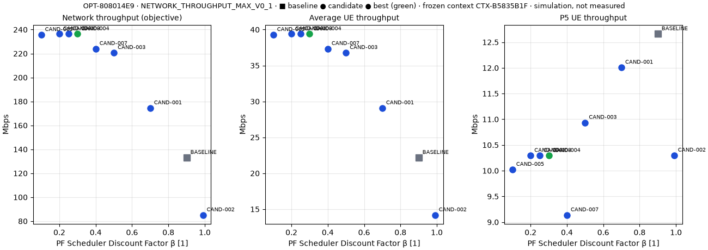
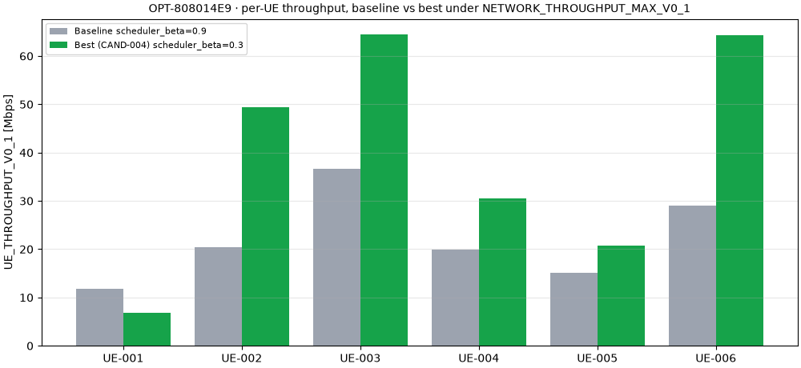

# Algorithm Integration Reference — OPT-808014E9

> 当前结果来自系统级仿真优化验证，不是华为实测网络优化结果。
> Research Demo Optimizer 为算法接入验证算法，不是项目科研成果，也不是学习优化算法。
> 本运行用于证明算法接入框架（suggest → evaluate → observe）可用；不要求优于 Grid Search，不用于验收。
> 独立复核 PASS ≠ 验收 PASS。

**Outcome (simulation only):** 在当前冻结仿真协议下，网络吞吐率提高 77.72%

| Field | Value |
|---|---|
| Optimization ID | `OPT-808014E9` |
| Algorithm ID | `research_demo_optimizer` |
| Algorithm Version | 0.1.0 |
| SDK Version | 0.1 |
| Category | research_demo (Integration Demo, 接入验证算法, Not Project Research Deliverable) |
| Learning Algorithm | NO |
| Purpose | 算法接入验证（Integration Demo） / Algorithm Integration Validation |
| Provider | 5GLOSVP platform (integration template) |
| Source | `src/algorithms/examples/research_demo_optimizer/algorithm.py` @ `94829c3-dirty` |
| Code Commit | `52eb45b` (run executed from the uncommitted Day 7 working tree; committed in this commit) |
| Algorithm Config Hash | `8504eff99258314bf1d9d8659266a105692ba5c9ef66513ba77b19ee296833e7` |
| Parameter Space Hash | `275eb7946569b515265c0d9ba016716aa66caf8fde103c9c09eec9894f99dc28` |
| Scenario | `SYSTEM-DEMO-001` (Multi-UE Downlink System Simulation Demo) |
| Backend | `sionna_system` 2.1.0 (Sionna Simulation Generated) |
| Benchmark Protocol | `SYSTEM_BENCHMARK_V0_1` v0.1 (500 slots, warm-up 0, 1 × single_run) |
| Objective | `NETWORK_THROUGHPUT_MAX_V0_1` v0.1 (maximize) |
| Parameter Space | `scheduler_beta` continuous [0.05, 0.99] (unit 1) |
| Search Space Source | [A] Engineering demonstration interval inside the open Sionna domain (0, 1); upper end equals the largest Grid Search demo value. |
| Hyperparameters | initial_step = 0.2, min_step = 0.05, shrink_factor = 0.5, max_iterations = 8, start_point = baseline (Recommended / auto-configured) |
| Evaluation Budget | 8 |
| Evaluations Used | 8 (simulations 8, cache hits 0, rejected suggestions 1) |
| Stop Reason | `budget_exhausted` — 1 suggestion(s) rejected: platform budget of 8 evaluations reached |
| Algorithm Recommendation | scheduler_beta = 0.3 (matches platform best: YES) |
| Baseline | scheduler_beta = 0.9 (`EXP-53D49CE5`) |
| Best Candidate | `CAND-004`: scheduler_beta = 0.3 (`EXP-4AE3E718`) |
| Network Throughput | 132.994 → 236.351 Mbps (+77.72%) |
| Average UE Throughput | 22.166 → 39.392 Mbps (+77.72%) |
| P5 Throughput | 12.659 → 10.293 Mbps (-18.70%, decrease) |
| Fairness Checks | ALL PASS (6 checks) |
| Independent verification | **PASS** (158/158 checks, 30 algorithm-level; decision replay reproduced) |
| Measured | NO |
| Huawei | NO |
| Acceptance | NO |
| Project Research Deliverable | NO |

P5 is the 5th-percentile UE throughput of this simulated UE population; it is **not** an edge-user acceptance rate.

## Algorithm rounds (suggest → evaluate → observe)

| Round | State before | Suggestions (scheduler_beta) | Evaluated | Rejected by budget | Decision (algorithm state) |
|---|---|---|---|---|---|
| 1 | explore · x=0.9 · step=0.2 | 0.7, 0.99 | CAND-001, CAND-002 | — | move 0.9 → 0.7 (improved) |
| 2 | extend · x=0.7 · step=0.2 | 0.5 | CAND-003 | — | move 0.7 → 0.5 (improved) |
| 3 | extend · x=0.5 · step=0.2 | 0.3 | CAND-004 | — | move 0.5 → 0.3 (improved) |
| 4 | extend · x=0.3 · step=0.2 | 0.1 | CAND-005 | — | no improvement around 0.3: step 0.2 → 0.1 |
| 5 | explore · x=0.3 · step=0.1 | 0.2, 0.4 | CAND-006, CAND-007 | — | no improvement around 0.3: step 0.1 → 0.05 |
| 6 | explore · x=0.3 · step=0.05 | 0.25, 0.35 | CAND-008 | 0.35 | partial observation (1/2 suggestions evaluated) |

## Algorithm trace

| # | Round | Candidate | scheduler_beta | Objective (Mbps) | Cache hit | Best so far |
|---|---|---|---|---|---|---|
| 0 | 0 | BASELINE | 0.9 | 132.994 | no | BASELINE |
| 1 | 1 | CAND-001 | 0.7 | 174.477 | no | CAND-001 |
| 2 | 1 | CAND-002 | 0.99 | 85.105 | no | CAND-001 |
| 3 | 2 | CAND-003 | 0.5 | 220.639 | no | CAND-003 |
| 4 | 3 | CAND-004 | 0.3 | 236.351 | no | CAND-004 |
| 5 | 4 | CAND-005 | 0.1 | 235.661 | no | CAND-004 |
| 6 | 5 | CAND-006 | 0.2 | 236.351 | no | CAND-004 |
| 7 | 5 | CAND-007 | 0.4 | 223.996 | no | CAND-004 |
| 8 | 6 | CAND-008 | 0.25 | 236.351 | no | CAND-004 |

Best-so-far uses the platform rule: objective (direction-normalized) first, then the baseline value,
then candidate order.

## Candidates → experiments

| Candidate | Round | scheduler_beta | Experiment | Network (Mbps) | P5 (Mbps) | Runtime (s) | Status |
|---|---|---|---|---|---|---|---|
| BASELINE (baseline) | 0 | 0.9 | EXP-53D49CE5 | 132.994 | 12.659 | 96.7 | evaluated |
| CAND-001 | 1 | 0.7 | EXP-88BF3E30 | 174.477 | 12.008 | 99.5 | evaluated |
| CAND-002 | 1 | 0.99 | EXP-7FA586EA | 85.105 | 10.299 | 99.9 | evaluated |
| CAND-003 | 2 | 0.5 | EXP-815D36FD | 220.639 | 10.936 | 99.1 | evaluated |
| CAND-004 (best) | 3 | 0.3 | EXP-4AE3E718 | 236.351 | 10.293 | 99.1 | evaluated |
| CAND-005 | 4 | 0.1 | EXP-C2ADA5BB | 235.661 | 10.022 | 97.7 | evaluated |
| CAND-006 | 5 | 0.2 | EXP-CAE0170E | 236.351 | 10.293 | 96.5 | evaluated |
| CAND-007 | 5 | 0.4 | EXP-1065CAE6 | 223.996 | 9.137 | 97.4 | evaluated |
| CAND-008 | 6 | 0.25 | EXP-D2E2F946 | 236.351 | 10.293 | 97.7 | evaluated |

## Fair evaluation

| Check | Result | Detail |
|---|---|---|
| Same UE Population | PASS | UEP-8B69EFA7 sha256 8b69efa7d8173612… (9 evaluations) |
| Same Channel Realization | PASS | CH-18E6C548 sha256 6e91e01a57fb734c…; per-UE mean channel gain recomputed by the backend from the consumed channel matches |
| Same Traffic Model | PASS | FULL_BUFFER_V0_1 |
| Same Simulation Horizon | PASS | 500 slots, warm-up 0 |
| Same Backend Version | PASS | sionna_system 2.1.0 |
| Only Optimization Variable Changed | PASS | scheduler (except β), link adaptation and power control identical to the context |

Common evaluation context `CTX-B5835B1F`: UE population `UEP-8B69EFA7`
(6 UEs), channel `CH-18E6C548`
(`6e91e01a57fb734c014b68721b57602d7711ae775af429c24af41546f4c9fa47`), traffic `FULL_BUFFER_V0_1`.

## Per-UE throughput (baseline → best, Mbps)

| UE | Baseline | Best | Δ |
|---|---|---|---|
| UE-001 | 11.859 | 6.795 | -5.064 |
| UE-002 | 20.481 | 49.377 | +28.896 |
| UE-003 | 36.655 | 64.481 | +27.826 |
| UE-004 | 19.886 | 30.533 | +10.647 |
| UE-005 | 15.062 | 20.785 | +5.724 |
| UE-006 | 29.052 | 64.380 | +35.328 |

## Warnings

- P5_UE_THROUGHPUT_V0_1 decreased -18.70% (12.659 → 10.293 Mbps)

## Files

- `optimization.json` — full persisted record (algorithm provenance, parameter space, budget, trace, candidates).
- `algorithm-metadata.json`, `parameter-space.json`, `algorithm-config.json`, `algorithm-trace.json`
  — algorithm evidence.
- `evaluation-context.json`, `benchmark-protocol.json`, `candidate-summary.json` — exported by the backend.
- `evidence-descriptor.json` — verification status (independent) and acceptance eligibility (always false).
- `verification.json` — `scripts/verify_algorithm_run.py` (independent; imports nothing from `src/`).
- `screenshots/` — browser smoke screenshots.

Runtime: context 1.4 s, baseline 96.7 s,
candidates 787.7 s, total 887.0 s
(platform runtime, not an acceptance KPI).
