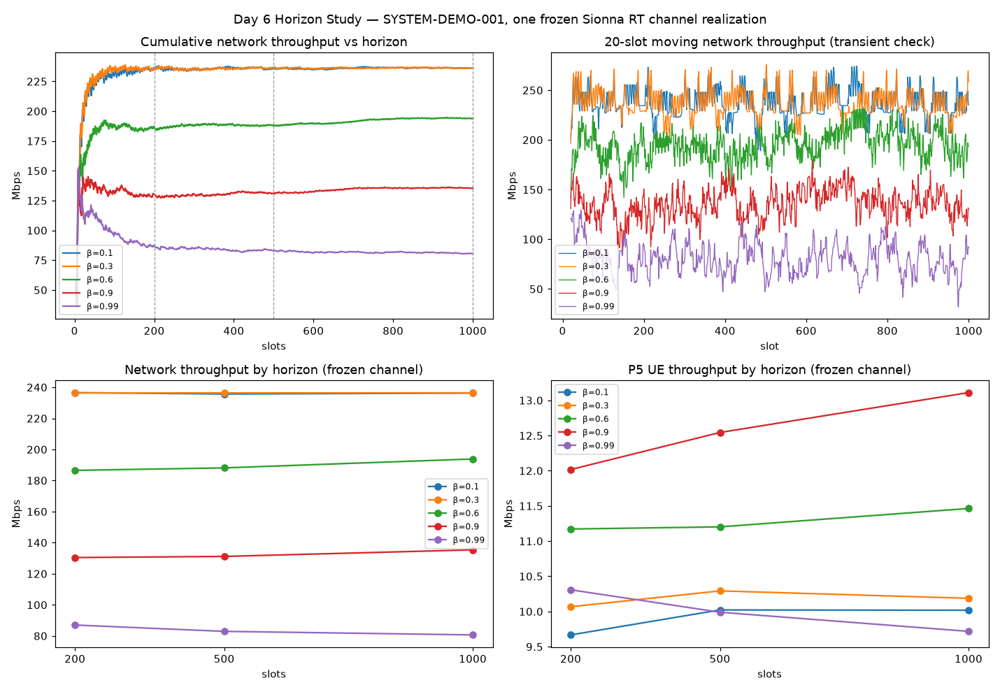

# Day 6 Horizon Study — SYSTEM_BENCHMARK_V0_1 input evidence

Produced by `scripts/day6_horizon_study.py` on 2026-09-28 (Sionna 2.1.0 / sionna-rt 2.1.0 / Mitsuba 3.9.1 /
Dr.Jit 1.5.0 / torch 2.14.0; SYS on CPU).

**Question:** which simulation horizon, warm-up and repeat count give a *stable* comparison of
`scheduler_beta` candidates at acceptable runtime? The protocol was chosen on stability and runtime,
**not** on which horizon shows the largest improvement.

## Setup

| Item | Value |
|---|---|
| Scenario | `SYSTEM-DEMO-001` (6 UEs, full buffer, seed fixed) |
| Channel | one Sionna RT realization A, sha256 `2faf4843b125…`, CFR `[6,1,1,8,12,3276]` complex64 (RT 1.07 s) |
| Candidates | β ∈ {0.1, 0.3, 0.6, 0.9, 0.99} (Sionna `PFSchedulerSUMIMO` discount factor, open interval (0,1)); baseline 0.9 |
| Horizons | 200 / 500 / 1000 slots (prefixes of one 1000-slot run per β) |
| Warm-up windows | 0 / 20 / 50 / 100 slots |
| KPIs | NETWORK / AVG_UE / P5_UE throughput V0_1 (Day 5 definitions, unchanged) |

## Results

Network throughput (Mbps) and P5 UE throughput (Mbps) on the frozen channel:

| β | Net 200 | Net 500 | Net 1000 | P5 200 | P5 500 | P5 1000 | s/slot |
|---|---|---|---|---|---|---|---|
| 0.1 | 236.58 | 235.66 | 236.28 | 9.67 | 10.02 | 10.02 | 0.195 |
| 0.3 | 236.33 | 236.35 | 236.42 | 10.07 | 10.29 | 10.19 | 0.194 |
| 0.6 | 186.52 | 188.13 | 193.86 | 11.17 | 11.20 | 11.46 | 0.194 |
| 0.9 | 130.42 | 131.14 | 135.37 | 12.02 | 12.54 | 13.11 | 0.195 |
| 0.99 | 86.99 | 82.92 | 80.64 | 10.31 | 9.99 | 9.72 | 0.194 |

- **Ranking (network throughput):** 200 → 0.1 > 0.3 > 0.6 > 0.9 > 0.99; 500 and 1000 → 0.3 > 0.1 > 0.6 > 0.9 > 0.99.
  The 200-slot swap of the top two is a 0.1% difference.
- **Convergence vs 1000 slots (max over β):** 200 slots 7.9% network / 8.3% P5; 500 slots 3.1% / 4.3%.
- **Trade-off visible at every horizon:** network throughput falls as β rises while P5 peaks at β = 0.9 —
  lower β favours strong UEs, higher β is fairer. A network-throughput objective therefore trades away P5.
- **Transient / warm-up:** the cumulative curves settle within ~50 slots. At 500 slots, warm-up 20/50/100
  changes network throughput by ≤ 1.05% for β ≤ 0.9 and by −1.9 / −4.1 / −4.7% for β = 0.99 (its
  initial transient is favourable). No warm-up choice changes the ranking at 500 or 1000 slots.
- **Determinism:** a repeated 200-slot run on the same channel is bit-identical; the 200- and 500-slot
  prefixes of the 1000-slot run equal separate 200/500-slot runs (`determinism` in `results.json`).
- **RT drift:** a second RT realization B (sha256 `df0a235cb4a8…`) differs by max |Δgain| 0.0031 dB; at
  200 slots, β = 0.9 gives network 130.42 → 131.20 Mbps (+0.60%) and P5 12.02 → 12.74 Mbps (+6.0%).
  This is why every optimization run freezes one channel and shares it across all candidates.

## Decision → SYSTEM_BENCHMARK_V0_1

| Setting | Value | Reason |
|---|---|---|
| Slots | **500** | shortest horizon with the same ranking as 1000; ≤ 3.2% from 1000-slot values; 97 s / evaluation |
| Warm-up | **0** | keeps the Day 5 KPI window; ranking warm-up-invariant (slightly *reduces* the 0.3 vs 0.9 gap) |
| Repeats | **1 (single_run)** | frozen channel ⇒ bit-identical repeats |
| Observed variability | **6.9 %** (network) | Day 5 three independent full runs 130.42–139.40 Mbps; conservative vs 0.60% A/B drift |

Limitations: one scenario, one channel realization, full-buffer traffic; absolute KPI levels at 500 slots
are not fully converged; the variability bound comes from 3 runs. Changing any setting requires a new
protocol version — see `docs/benchmark/system-benchmark-v0.1.md`.

## Files

- `results.json` — all KPIs per β / horizon / warm-up, per-UE values, ranking, determinism, RT drift.
- `slot_traces.npz` — per-slot decoded bits `[1000, 6]` per β (for independent recomputation).
- `plot.png` — cumulative / moving-average curves and KPI-vs-horizon points.
