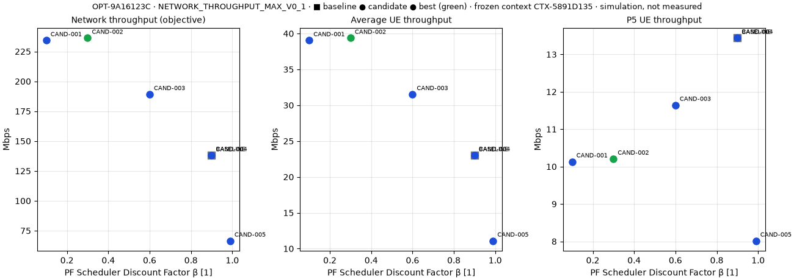
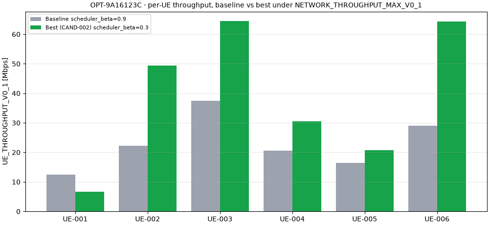

# System Optimization Reference — OPT-9A16123C

> 当前结果来自系统级仿真优化验证，不是华为实测网络优化结果。
> Grid Search 为工程基线优化器，不属于项目学习优化算法。

**Outcome:** 在当前冻结仿真协议下，网络吞吐率提高 71.15%

| Field | Value |
|---|---|
| Optimization ID | `OPT-9A16123C` |
| Commit | `6417ffd` |
| Scenario | `SYSTEM-DEMO-001` (Multi-UE Downlink System Simulation Demo) |
| Backend | `sionna_system` (Sionna Simulation Generated) |
| Backend Version | 2.1.0 |
| Optimizer | `grid_search` v0.2 (engineering_baseline) |
| Learning Algorithm | NO |
| Objective | `NETWORK_THROUGHPUT_MAX_V0_1` v0.1 (maximize) |
| Optimization Variable | `scheduler_beta` (PF Scheduler Discount Factor β, bounds (0.0, 1.0)) |
| Baseline Parameter | scheduler_beta = 0.9 |
| Candidate Values | 0.1, 0.3, 0.6, 0.9, 0.99 |
| Best Parameter | scheduler_beta = 0.3 (`CAND-002`) |
| Baseline Network Throughput | 138.033 Mbps (`EXP-02690510`) |
| Best Network Throughput | 236.236 Mbps (`EXP-27BD3740`) |
| Absolute Improvement | +98.204 Mbps |
| Relative Improvement | +71.15% |
| Baseline P5 | 13.437 Mbps |
| Best P5 | 10.206 Mbps (decrease) |
| Benchmark Protocol | `SYSTEM_BENCHMARK_V0_1` v0.1 (frozen 2026-09-28) |
| Simulation Slots | 500 |
| Warmup | 0 |
| Repeat Count | 1 (single_run) |
| Same UE | YES |
| Same Channel | YES |
| Same Traffic | YES |
| Same Horizon / Backend / Only Variable Changed | YES / YES / YES |
| Measured | NO |
| Huawei | NO |
| Acceptance | NO |
| Independent verification | **PASS** (92/92 checks) |

## Common evaluation context

| Item | ID | sha256 |
|---|---|---|
| Context | `CTX-5891D135` | — |
| UE population (6 UEs) | `UEP-8B69EFA7` | `8b69efa7d8173612977980718486d76b54ea7fcb6f4ebd44099935a12557c64b` |
| Channel realization | `CH-F5A10364` | `3647ca8e464fe43203f7ad4a655d4b9882fef213de39915fc9de18a5ef026a41` |
| Traffic | `FULL_BUFFER_V0_1` | `e9df3b2f7c85bd0410a401d50824ab7518e750ad4af5ccc15b284614b53fef3d` |
| Scenario version | — | `424652032653a9a6ae6df56365fac8f8302dff1e35074dfa9479b13f00514a63` |

Channel hash rule: sha256 over sorted array keys; per key: key utf-8, dtype str, JSON shape, C-order bytes.

## KPI changes (baseline → best)

| KPI | Baseline (Mbps) | Best (Mbps) | Δ (Mbps) | Δ % | Direction |
|---|---|---|---|---|---|
| NETWORK_THROUGHPUT_V0_1 | 138.033 | 236.236 | +98.204 | +71.15% | increase |
| AVG_UE_THROUGHPUT_V0_1 | 23.005 | 39.373 | +16.367 | +71.15% | increase |
| P5_UE_THROUGHPUT_V0_1 | 13.437 | 10.206 | -3.231 | -24.04% | decrease |

Negative KPI changes: P5_UE_THROUGHPUT_V0_1.
Within observed variability (±6.9%): NO.
Tie-break rule: Equal objective → baseline parameter value first, then candidate definition order.

## Candidates

| Candidate | scheduler_beta | Experiment | Network (Mbps) | Average (Mbps) | P5 (Mbps) | Runtime (s) | Status |
|---|---|---|---|---|---|---|---|
| BASELINE (baseline) | 0.9 | EXP-02690510 | 138.033 | 23.005 | 13.437 | 98.7 | evaluated |
| CAND-001  | 0.1 | EXP-C89283BE | 234.226 | 39.038 | 10.133 | 100.4 | evaluated |
| CAND-002 (best) | 0.3 | EXP-27BD3740 | 236.236 | 39.373 | 10.206 | 99.3 | evaluated |
| CAND-003  | 0.6 | EXP-E00E81B6 | 189.109 | 31.518 | 11.645 | 98.4 | evaluated |
| CAND-004 (reused baseline) | 0.9 | EXP-02690510 | 138.033 | 23.005 | 13.437 | 0.0 | evaluated |
| CAND-005  | 0.99 | EXP-B14E2CEC | 66.508 | 11.085 | 8.015 | 98.6 | evaluated |

## Per-UE throughput (baseline → best, Mbps)

| UE | Baseline | Best | Δ |
|---|---|---|---|
| UE-001 | 12.427 | 6.680 | -5.747 |
| UE-002 | 22.157 | 49.377 | +27.220 |
| UE-003 | 37.433 | 64.481 | +27.049 |
| UE-004 | 20.593 | 30.533 | +9.940 |
| UE-005 | 16.467 | 20.785 | +4.318 |
| UE-006 | 28.955 | 64.380 | +35.424 |

## Warnings

- P5_UE_THROUGHPUT_V0_1 decreased -24.04% (13.437 → 10.206 Mbps)

## Files

- `optimization.json` — full persisted record (context, candidates, comparison, fairness, provenance).
- `evaluation-context.json`, `benchmark-protocol.json`, `candidate-summary.json` — exported by the backend.
- `verification.json` — `scripts/verify_system_optimization.py` (independent recomputation from slot traces).
- `comparison.png`, `per-ue-comparison.png` — backend-rendered plots.
- `screenshots/` — browser smoke screenshots 01–08.

Runtime: context 1.2 s, baseline 98.7 s,
candidates 397.1 s, total 497.6 s
(platform runtime, not an acceptance KPI).
